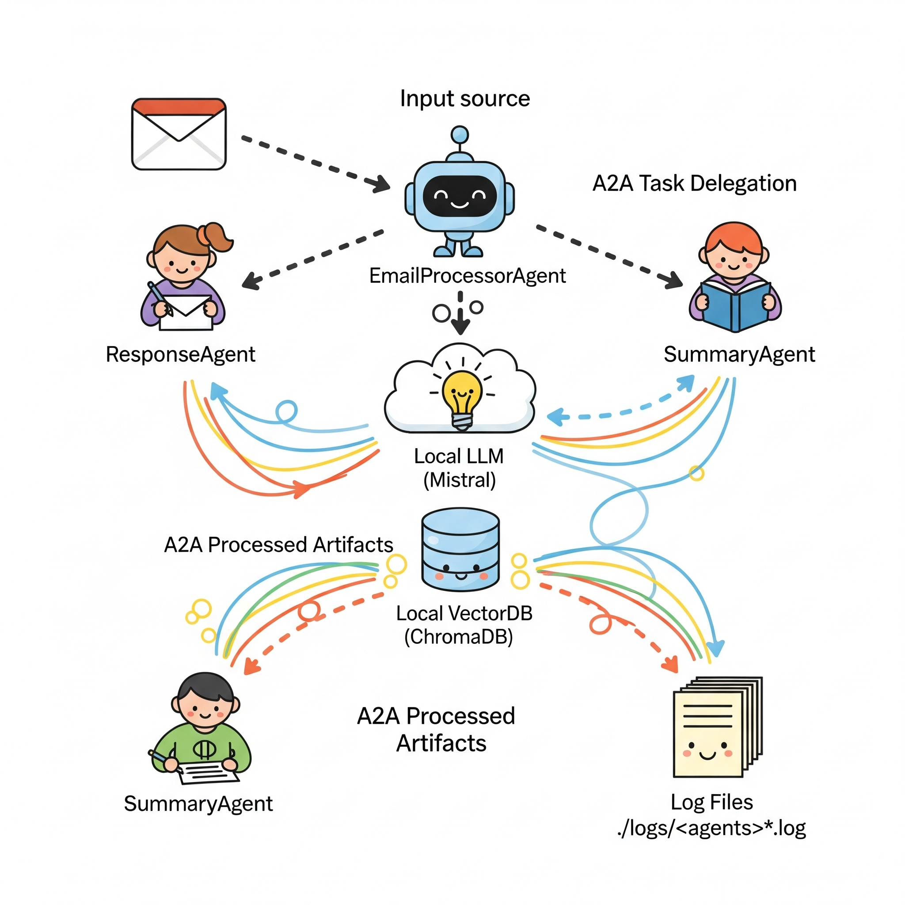
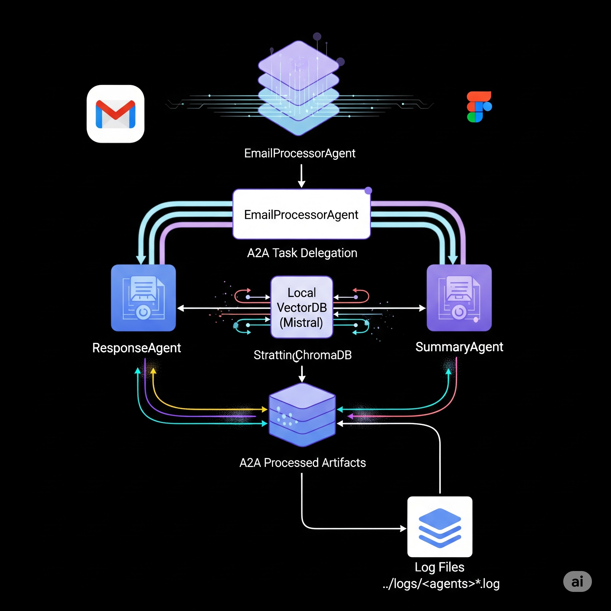
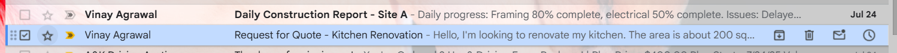

# A2A Auto Email Processor - Agent Architecture

[](https://opensource.org/licenses/MIT)
[](https://www.python.org/downloads/)
[](https://www.docker.com/)

# Demo
https://www.linkedin.com/embed/feed/update/urn:li:ugcPost:7355832919816359937?collapsed=1




## Overview

This document provides a comprehensive guide to the Agent-to-Agent (A2A) architecture used in the Contractor Automation system. The system is built using Google's A2A framework, which enables seamless communication between specialized agents to automate email processing, response generation, and summarization for contractor management.

## Architecture Overview

The system follows a microservices architecture where each agent is an independent service with specific responsibilities. Agents communicate using the A2A protocol over HTTP, enabling loose coupling and scalability.




## Agent Communication Flow

1. **Email Processor**
   - Listens for new emails via Gmail API
   - Processes and classifies incoming emails
   - Forwards emails to the appropriate agent based on classification
   - Maintains the state of email processing tasks

2. **Response Agent**
   - Generates contextually appropriate responses to emails
   - Handles direct queries and common questions
   - Implements response templates and dynamic content generation

3. **Summary Agent**
   - Processes and summarizes email threads
   - Maintains conversation history
   - Provides executive summaries of ongoing communications

## A2A Framework Implementation

The system leverages Google's A2A (Agent-to-Agent) framework, which provides:

```
                                                     ┌──────────────────┐  
                                                     │   Response Agent │
                                                     └──────────────────┘
 ┌─────────────────┐        ┌─────────────────┐        
 │   Gmail API     │─────▶ │  Email Processor│────▶
 └─────────────────┘        └─────────────────┘     
                                                    ┌─────────────────┐
                                                    │   Summary Agent │
                                                    └─────────────────┘
```

### Core A2A Features

1. **Service Discovery**: Automatic discovery of available agents through Agent Cards
2. **Standardized Communication**: Unified API for inter-agent communication
3. **Task Management**: Built-in support for long-running tasks with progress tracking
4. **Error Handling**: Consistent error reporting and recovery mechanisms
5. **Streaming Support**: Real-time, incremental updates for tasks and artifacts

### A2A Streaming Protocol

The A2A framework supports real-time, incremental updates through Server-Sent Events (SSE), enabling efficient streaming of task status changes and artifacts. This is particularly useful for long-running tasks where immediate feedback is valuable.

#### Key Streaming Features

- **Real-time Updates**: Receive immediate notifications about task status changes
- **Efficient Data Transfer**: Only send incremental updates
- **Bi-directional Communication**: While primarily server-to-client, the protocol supports ongoing interaction
- **Support for Large Payloads**: Stream large artifacts in chunks


#### Response Format (SSE Stream)

The server responds with a stream of Server-Sent Events (SSE), where each event contains a JSON-RPC 2.0 response object.

##### Task Status Update Event

```json
{
  "jsonrpc": "2.0",
  "id": "request-id",
  "result": {
    "taskId": "task-123",
    "contextId": "context-456",
    "kind": "status-update",
    "status": "in-progress",
    "final": false,
    "metadata": {
      "progress": 50,
      "message": "Processing your request..."
    }
  }
}
```

##### Artifact Update Event

```json
{
  "jsonrpc": "2.0",
  "id": "request-id",
  "result": {
    "taskId": "task-123",
    "contextId": "context-456",
    "kind": "artifact-update",
    "artifact": {
      "id": "artifact-789",
      "type": "text/plain",
      "content": "This is a chunk of the artifact..."
    },
    "append": true,
    "lastChunk": false
  }
}
```

### Error Handling

- **Connection Errors**: Automatically retry with exponential backoff
- **Invalid Messages**: Log and skip malformed events
- **Rate Limiting**: Respect Retry-After headers
- **Timeouts**: Implement appropriate timeouts for both connection and response streaming

## Gmail Integration

The system includes a robust Gmail integration component that enables automated email processing through the Gmail API. This component is implemented in `gmail_agent_integration.py`.

### Key Features

- **Email Retrieval**: Fetches emails from Gmail using the Gmail API
- **Email Processing**: Converts Gmail messages into a standardized format
- **Attachment Handling**: Extracts and processes email attachments
- **A2A Integration**: Seamlessly integrates with the A2A agent framework
- **Error Handling**: Comprehensive error handling and retry mechanisms

### Configuration

1. **Gmail API Credentials**:
   - Create a project in Google Cloud Console
   - Enable the Gmail API
   - Create OAuth 2.0 credentials
   - Download the credentials JSON file as `credentials.json`

2. **Environment Variables**:
   ```
   GOOGLE_APPLICATION_CREDENTIALS=path/to/credentials.json
   EMAIL_PROCESSOR_URL=http://localhost:8001
   A2A_AGENT_URL=http://localhost:8001
   PROCESSING_INTERVAL=300  # seconds
   ```

### Usage

```bash
python gmail_agent_integration.py
```



## Test Email Processor

The `test_email_processor.py` script provides a testing framework for the email processor agent, allowing you to validate the email processing pipeline without sending actual emails.

### Features

- **Test Email Generation**: Creates realistic test email payloads
- **Streaming Support**: Tests both streaming and non-streaming modes
- **Debugging Tools**: Detailed logging and error reporting
- **Endpoint Validation**: Verifies agent endpoints are accessible

### Usage

```bash
# Test with streaming (default)
python test_email_processor.py --agent http://localhost:8001

# Test without streaming
python test_email_processor.py --agent http://localhost:8001 

# Enable debug output
python test_email_processor.py --agent http://localhost:8001 --debug
```

### Test Email Payload

The test script generates emails with the following structure:

```python
{
    "id": "unique-email-id",
    "subject": "Test Email Subject",
    "sender": "test@example.com",
    "recipients": ["recipient@example.com"],
    "body": "This is a test email body.",
    "received_at": "2025-07-27T22:00:00Z",
    "metadata": {
        "thread_id": "test-thread-123",
        "labels": ["INBOX", "UNREAD"]
    },
    "attachments": [
        {
            "filename": "test.txt",
            "mime_type": "text/plain",
            "size": 1024
        }
    ]
}
```

- **Service Discovery**: Automatic discovery of available agents
- **Standardized Communication**: Unified API for inter-agent communication
- **Task Management**: Built-in support for long-running tasks with progress tracking
- **Error Handling**: Consistent error reporting and recovery mechanisms

### Key A2A Components

1. **AgentCard**
   - Defines the agent's capabilities and metadata
   - Includes supported input/output formats
   - Specifies the agent's API endpoints

2. **AgentExecutor**
   - Implements the core business logic of each agent
   - Handles incoming requests and delegates to appropriate handlers
   - Manages task state and progress updates

3. **Request Handler**
   - Processes incoming HTTP requests
   - Validates input data
   - Routes requests to the appropriate executor methods

## Agent Implementation Details

### Email Processor Agent

**Purpose**: Processes incoming emails and routes them to the appropriate handler.

**Key Features**:
- Email parsing and validation
- Content classification
- Task initiation and management
- Error handling and retry logic

**Dependencies**:
- A2A Server
- Gmail API credentials

### Response Agent

**Purpose**: Generates appropriate responses to incoming emails.

**Key Features**:
- Response template management
- Dynamic content generation
- Context-aware response selection
- Multi-language support

**Dependencies**:
- A2A Server
- LLM integration (Ollama/LM Studio)

### Summary Agent

**Purpose**: Generates summaries of email threads and conversations.

**Key Features**:
- Thread analysis
- Key point extraction
- Summary generation
- Context preservation

**Dependencies**:
- A2A Server
- Vector database (ChromaDB)
- LLM integration

## Communication Protocol

Agents communicate using a standardized JSON-based protocol over HTTP. Each message includes:

```json
{
  "task_id": "unique-task-identifier",
  "action": "action-name",
  "parameters": {
    "key": "value"
  },
  "metadata": {
    "source": "source-agent",
    "timestamp": "ISO-8601-timestamp"
  }
}
```

## Error Handling

The system implements a comprehensive error handling strategy:

1. **Input Validation**: All inputs are validated against schemas
2. **Retry Logic**: Transient failures are automatically retried
3. **Circuit Breaker**: Prevents cascading failures
4. **Dead Letter Queue**: Failed messages are stored for later analysis

## Gmail Integration Setup

### Prerequisites
1. A Google Cloud Platform (GCP) project with the Gmail API enabled
2. OAuth 2.0 credentials configured in the GCP Console
3. Required Python packages: `google-api-python-client`, `google-auth-oauthlib`, `google-auth-httplib2`

### Configuration

1. **Enable Gmail API**
   - Go to [Google Cloud Console](https://console.cloud.google.com/)
   - Create a new project or select an existing one
   - Enable the Gmail API
   - Configure the OAuth consent screen
   - Create OAuth 2.0 credentials (OAuth client ID)
   - Download the credentials JSON file as `credentials.json`

2. **Environment Variables**
   Add these to your `.env` file:
   ```
   GMAIL_CREDENTIALS_PATH=./config/credentials.json
   GMAIL_TOKEN_PATH=./config/token.json
   GMAIL_SCOPES=https://www.googleapis.com/auth/gmail.modify
   ```

3. **First-Time Authorization**
   Run the authentication flow:
   ```bash
   python -m a2a_agents.utils.gmail_auth
   ```
   - This will open a browser window for Google OAuth authentication
   - After authenticating, a `token.json` file will be generated

## Running Mistral Locally with Ollama

### Prerequisites
1. Install [Ollama](https://ollama.ai/)
2. Install the Mistral model

### Setup Instructions

1. **Install Ollama**
   - Windows:
     ```powershell
     winget install ollama
     ```
   - macOS:
     ```bash
     brew install ollama
     ```
   - Linux:
     ```bash
     curl -fsSL https://ollama.ai/install.sh | sh
     ```

2. **Download Mistral Model**
   ```bash
   ollama pull mistral
   ```

3. **Run Ollama Server**
   ```bash
   ollama serve
   ```
   This will start the server on `http://localhost:11434`

4. **Configure the Application**
   Update your `.env` file:
   ```
   LLM_API_KEY=ollama
   LLM_BASE_URL=http://localhost:11434
   LLM_MODEL=mistral
   ```

5. **Test the Setup**
   ```python
   from utils.llm_client import LLMClient
   
   llm = LLMClient()
   response = llm.generate("Hello, how are you?")
   print(response)
   ```

## Monitoring and Logging

- Structured logging with correlation IDs
- Performance metrics collection
- Health check endpoints
- Distributed tracing

## Security Considerations

- All inter-service communication is encrypted (HTTPS)
- API key authentication between services
- Role-based access control
- Input sanitization and validation

## 🚀 Quick Start with Docker

The easiest way to get started is using Docker Compose, which will set up all the necessary services with a single command.

### Prerequisites

- [Docker](https://docs.docker.com/get-docker/) and [Docker Compose](https://docs.docker.com/compose/install/)
- [Ollama](https://ollama.ai/) or another LLM service running locally

### 1. Clone the Repository

```bash
git clone https://github.com/yourusername/a2a-mcp-contractor-automation.git
cd a2a-mcp-contractor-automation/a2a_agents
```

### 2. Set Up Environment

Copy the example environment file and update it with your configuration:

```bash
cp .env.example .env
# Edit the .env file with your settings
```

### 3. Start the Services

```bash
docker-compose up --build -d
```

### 4. Access the Services

Once all services are up and running, you can access them at:

- **A2A Server**: http://localhost:8000
- **Email Processor**: http://localhost:8001
- **Response Agent**: http://localhost:8002
- **Summary Agent**: http://localhost:8003
- **ChromaDB UI**: http://localhost:8004

### 5. View Logs

To monitor the services:

```bash
# View all logs
docker-compose logs -f

# View logs for a specific service
docker-compose logs -f email_processor
docker-compose logs -f response_agent
docker-compose logs -f summary_agent
```

## 🛠 Manual Setup (Development)

If you prefer to run the services manually outside of Docker:

### Prerequisites

- Python 3.13+
- [Poetry](https://python-poetry.org/) for dependency management
- Ollama or another LLM service
- ChromaDB or another vector database

### 1. Install Dependencies

```bash
# Install Python dependencies
poetry install

# Activate the virtual environment
poetry shell
```

### 2. Configure Environment

Create and configure your `.env` file as shown in the Docker section.

### 3. Start the Services

In separate terminal windows:

```bash
# Start A2A Server
python -m a2a.server.main

# Start Email Processor
python -m a2a_agents.email_processor.__main__

# Start Response Agent
python -m a2a_agents.response_agent.__main__

# Start Summary Agent
python -m a2a_agents.summary_agent.__main__
```

## 🧪 Development

### Project Structure

```
a2a_agents/
├── a2a_agents/
│   ├── email_processor/  # Email processing agent
│   ├── response_agent/   # Response generation agent
│   └── summary_agent/    # Summary generation agent
├── tests/               # Test files
├── .env.example         # Example environment variables
├── docker-compose.yml   # Docker Compose configuration
├── Dockerfile           # Docker configuration
└── pyproject.toml       # Project dependencies
```


### Running Tests

```bash
# Run all tests
pytest

# Run tests with coverage
pytest --cov=a2a_agents tests/

# Run a specific test file
pytest tests/test_email_processor.py
```

### Code Style

This project uses:
- **Black** for code formatting
- **isort** for import sorting
- **flake8** for linting


## 🐛 Troubleshooting

### Common Issues

1. **Port Already in Use**
   ```bash
   # Find and kill the process using a specific port
   sudo lsof -i :8000
   kill -9 <PID>
   ```

2. **Docker Container Issues**
   ```bash
   # Rebuild and restart all services

   docker-compose up --build -d

   docker-compose down
   ```

3. **LLM Connection Issues**
   - Ensure Ollama (or your LLM service) is running
   - Check the OLLAMA_API_BASE in your .env file
   - Verify network connectivity between containers

4. **ChromaDB Issues**
   - Ensure the data directory has proper permissions
   - Check if ChromaDB is accessible
   - Reset the database if needed (data will be lost):
     ```bash
     docker-compose down -v
     ```

### Viewing Logs

```bash
# View logs for all services
docker-compose logs -f

# View logs for a specific service
docker-compose logs -f email_processor

# View the last 100 lines of logs
docker-compose logs --tail=100

# Follow logs in real-time
docker-compose logs -f --tail=50
```


MIT License - See [LICENSE](../LICENSE) for details
