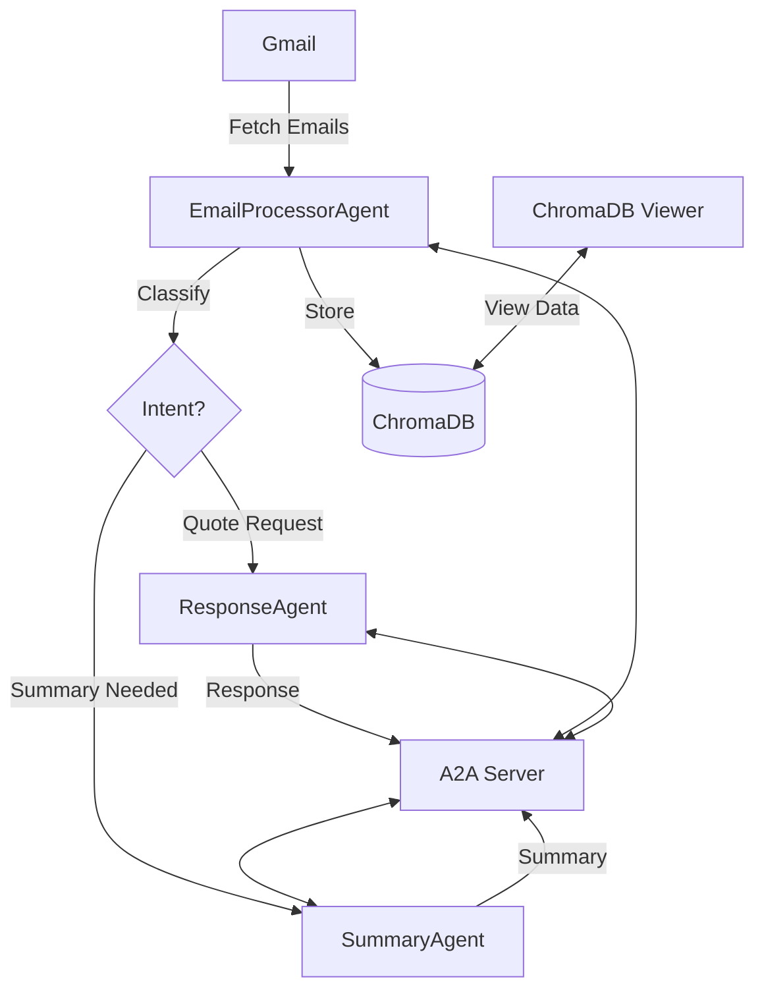

# A2A Contractor Email Automation

*Last Updated: July 25, 2025*

A lightweight demo application showcasing Agent-to-Agent (A2A) communication using A2A SDK for automating email management in a small business contractor setting. This system processes incoming emails, generates appropriate responses, and maintains a searchable database of email interactions using ChromaDB.

## Quick Start with Docker

### Prerequisites
1. Python 3.13
2. Poetry (for dependency management)
3. Local LLM (Ollama or LM Studio)
4. Gmail API credentials

### 1. Clone the Repository
```bash
git clone https://github.com/yourusername/a2a-mcp-contractor-automation.git
cd a2a-mcp-contractor-automation
```

### 2. Set Up Environment
```bash
# Create necessary directories
mkdir -p data output logs

# Make sure Docker Desktop is running
```

### 3. Start the Services
```bash
# Start all services in detached mode
docker-compose up --build -d

# View logs
docker-compose logs -f
```

### 4. Access the Services
- **A2A Server**: http://localhost:8000
- **Email Processor**: http://localhost:8001
- **Response Agent**: http://localhost:8002
- **Summary Agent**: http://localhost:8003
- **ChromaDB Viewer**: http://localhost:5000

### 5. Run the Gmail Integration
```bash
# Make sure to run this from your host machine
python gmail_agent_integration.py
```

### 6. Stop the Services
```bash
docker-compose down
```

## Features

- **Gmail Integration**: Directly fetch and process emails from Gmail
- **Automated Classification**: Categorize incoming emails using local LLM
- **Intelligent Responses**: Generate context-aware responses for quote requests
- **Daily Summaries**: Automatic generation of daily email interaction summaries
- **Searchable Database**: Store and query email interactions with ChromaDB
- **Web Interface**: Built-in ChromaDB viewer for easy data exploration
- **Modular Architecture**: Clean A2A architecture with specialized agents
- **Local AI**: Runs entirely on your machine with Ollama or LM Studio

## Architecture



The system consists of multiple specialized agents working together:

1. **EmailProcessorAgent** (Port: 8001)
   - Monitors and processes incoming emails
   - Classifies email intent using local LLM
   - Delegates tasks to appropriate agents
   - Stores all responses and summaries in ChromaDB
   - Handles Gmail API integration

2. **ResponseAgent** (Port: 8002)
   - Generates customized responses for quote requests
   - Uses local templates and LLM for response customization
   - Maintains response consistency and tone
   - Lightweight, stateless service

3. **SummaryAgent** (Port: 8003)
   - Creates concise summaries of email interactions
   - Uses local LLM for summarization
   - Returns summaries to EmailProcessor for storage
   - Focused solely on summarization logic

4. **ChromaDB** (Persistent Storage)
   - Centralized storage for all emails, responses, and summaries
   - Persistent storage in `./data/chroma`
   - Web interface available at `http://localhost:5000`
   - Search and filter functionality

## Prerequisites


## Recent Updates

### Architecture Refactor (2025-07-25)
- Centralized ChromaDB storage in EmailProcessor
- Removed ChromaDB dependency from SummaryAgent
- Simplified agent communication flow
- Added ChromaDB viewer for data inspection

### Docker Support (2025-07-24)
- Added Docker Compose for easy deployment
- Containerized all agents
- Simplified setup process
- Improved networking between services

### Gmail Integration (2025-07-24)
- Added direct Gmail API integration for email fetching
- Automatic processing of incoming emails
- Support for attachments and rich text emails

### ChromaDB Migration (2024-07-23)
- Updated to use the new `PersistentClient` API
- Removed deprecated `Settings` configuration
- Added web-based ChromaDB viewer
- Improved data persistence and recovery

### New Features
- Added `gmail_agent_integration.py` for Gmail processing
- Enhanced logging and error handling
- Improved email parsing and metadata extraction
- Added support for multiple email formats

To upgrade an existing installation:
```bash
pip install --upgrade chromadb google-auth-oauthlib google-api-python-client httpx
# If you have existing data, migrate it using:
# pip install chroma-migrate
# chroma-migrate
```

## Local Development Setup

### 1. Install Dependencies
```bash
# Install Poetry if you haven't already
pip install poetry

# Install project dependencies
poetry install

# Activate the virtual environment
poetry shell
```

## A2A Communication Components

The system uses Agent-to-Agent (A2A) communication for service discovery and inter-process communication. Here's how it works:

### Key Components

1. **A2A Server**
   - Central registry for service discovery
   - Manages agent registration and health checks
   - Runs on port 8000 by default
   - Provides REST API for service registration and discovery
   - Maintains a list of available services and their capabilities

2. **Agents**
   - **Email Processor Agent**: Routes tasks to appropriate agents
     - Capabilities: `email_processing`, `task_delegation`
     - Default Port: 8001
   - **Response Agent**: Generates responses to emails
     - Capabilities: `response_generation`
     - Default Port: 8002
   - **Summary Agent**: Creates summaries of email threads
     - Capabilities: `summarization`
     - Default Port: 8003

3. **Service Registration**
   Each agent registers itself with the A2A server on startup using HTTP POST:
   ```python
   # Example registration data
   registration_data = {
       "name": "agent_name",
       "url": f"http://{hostname}:{port}",
       "type": "agent",
       "capabilities": ["capability1", "capability2"]
   }
   
   # Register with A2A server
   response = await self.httpx_client.post(
       f"{self.a2a_server_url}/services",
       json=registration_data
   )
   response.raise_for_status()
   ```

4. **Service Discovery**
   Agents can discover other services by querying the A2A server:
   ```python
   # Get service information
   response = await self.httpx_client.get(
       f"{self.a2a_server_url}/services/service_name"
   )
   service_info = response.json()
   
   # Use the discovered service
   if service_info.get('url'):
       response = await self.httpx_client.post(
           f"{service_info['url']}/endpoint",
           json=payload
       )
   ```

5. **Agent Cards**
   Each agent maintains an agent card with metadata:
   ```python
   self.agent_card = {
       "type": "agent",
       "name": "Agent Name",
       "description": "Agent description",
       "version": "1.0.0",
       "url": service_url,
       "capabilities": ["capability1", "capability2"],
       "status": "ready"
   }
   ```

6. **Error Handling**
   - Failed registrations are logged but don't prevent agent startup
   - Service discovery failures are retried with exponential backoff
   - All inter-agent communication includes timeout handling

7. **Health Checks**
   - Each agent exposes a `/health` endpoint
   - The A2A server periodically verifies agent health
   - Unhealthy services are automatically unregistered

### 2. Set Up Environment Variables
Create a `.env` file in the project root:
```env
# A2A Server Settings
A2A_SERVER_URL=http://a2a_server:8000  # In Docker
# A2A_SERVER_URL=http://localhost:8000  # For local development
A2A_SERVER_PORT=8000

# Agent Settings
EMAIL_PROCESSOR_AGENT_PORT=8001
RESPONSE_AGENT_PORT=8002
SUMMARY_AGENT_PORT=8003

# Agent URLs (for inter-service communication)
A2A_SERVER_URL=http://a2a_server:8000
RESPONSE_AGENT_URL=http://response_agent:8002
SUMMARY_AGENT_URL=http://summary_agent:8003

# LLM Settings (Ollama)
LLM_URL=http://host.docker.internal:11434/api

# Database Settings
CHROMA_PERSIST_DIR=/app/data/chroma

# Gmail API Settings (Optional)
GMAIL_CREDENTIALS_PATH=./credentials/gmail_credentials.json
GMAIL_TOKEN_PATH=./token.json
```

### 3. Start Individual Agents
```bash
# Email Processor
python -m uvicorn agents.email_processor_agent:app --host 0.0.0.0 --port 8001

# Response Agent (in a new terminal)
python -m uvicorn agents.response_agent:app --host 0.0.0.0 --port 8002

# Summary Agent (in a new terminal)
python -m uvicorn agents.summary_agent:app --host 0.0.0.0 --port 8003
```

### 4. Run Gmail Integration
```bash
python gmail_agent_integration.py
```

### Expected Output
- The system will:
  1. Authenticate with Gmail (first time will open browser)
  2. Fetch and process the latest emails
  3. Generate responses and summaries
  4. Store everything in ChromaDB

### Verifying the Results
1. Access the ChromaDB viewer at `http://localhost:8000`
2. Check individual agent logs in the `logs/` directory
3. View daily summaries in `logs/summaries/`

## Setup Instructions

1. **Install Dependencies**
   ```bash
   # Install Python requirements
   pip install -r requirements.txt
   
   # Install development dependencies
   pip install pytest pytest-asyncio httpx
   ```

2. **Set up Ollama**
   ```bash
   # Install Ollama (Linux/Mac)
   curl -fsSL https://ollama.com/install.sh | sh
   
   # Or on Windows, download from https://ollama.ai/download
   
   # Start Ollama service
   ollama serve
   
   # Pull a model (recommended: mistral or llama3)
   ollama pull mistral
   ```

3. **Set up Gmail API**
   ```bash
   # Enable Gmail API
   1. Go to Google Cloud Console: https://console.cloud.google.com/
   2. Create a new project
   3. Enable Gmail API
   4. Configure OAuth consent screen
   5. Create OAuth 2.0 credentials
   6. Download credentials.json to project root
   ```

4. **Environment Configuration**
   Create a `.env` file in the project root:
   ```env
   # Required
   GMAIL_API_CREDENTIALS=./credentials.json
   LLM_URL=http://localhost:11434/api/generate
   
   # Optional
   LOG_LEVEL=INFO
   CHROMA_PERSIST_DIR=./chroma_data
   ```

5. **Running the System**

   **Option 1: Using the provided script (recommended)**
   ```bash
   # Start all agents
   ./run_agents.sh
   
   # In a separate terminal, start the ChromaDB viewer
   python run_chroma_viewer.py
   ```

   **Option 2: Run agents individually**
   ```bash
   # Terminal 1: Email Processor
   python agents/email_processor_agent.py
   
   # Terminal 2: Response Agent
   python agents/response_agent.py
   
   # Terminal 3: Summary Agent
   python agents/summary_agent.py
   
   # Terminal 4: ChromaDB Viewer
   python chroma_viewer/main.py
   ```

   **Option 3: Docker Compose**
   ```bash
   # Build and run all services
   docker-compose up --build
   ```

## Usage

### 1. Process Emails

**Via Gmail Integration**
```bash
# Process latest emails from Gmail
python gmail_agent_integration.py

# Process specific number of emails (e.g., 5)
python gmail_agent_integration.py --max-results 5
```

**Via API**
```bash
# Process a single email
curl -X POST http://localhost:8001/process_email \
-H "Content-Type: application/json" \
-d '{
  "sender": "customer@example.com",
  "subject": "Request for Quote",
  "body": "I'm interested in your services..."
}'
```

### 2. View Data
- **ChromaDB Viewer**: `http://localhost:8000`
- **Daily Summaries**: `logs/summaries/daily_summary_YYYY-MM-DD.txt`
- **Agent Logs**: `logs/` directory

### 3. Search and Query
Use the ChromaDB viewer to:
- Browse all stored emails and summaries
- Search by content, sender, or date
- View relationships between messages

## Project Structure

```
a2a-mcp-contractor-automation/
├── agents/                     # Agent implementations
│   ├── __init__.py
│   ├── email_processor_agent.py  # Processes incoming emails
│   ├── response_agent.py        # Generates responses
│   └── summary_agent.py         # Creates email summaries
│
├── chroma_viewer/             # Web interface for ChromaDB
│   ├── static/                # Frontend assets
│   ├── templates/             # HTML templates
│   └── main.py                # FastAPI application
│
├── logs/                      # Log files
│   └── summaries/             # Daily email summaries
│
├── tests/                     # Test files
│   ├── test_email_processor.py
│   └── test_summary_agent.py
│
├── .env.example              # Example environment variables
├── config.py                 # Configuration settings
├── gmail_agent_integration.py # Gmail API integration
├── requirements.txt           # Python dependencies
├── run_agents.sh             # Script to start all agents
└── run_chroma_viewer.py      # Script to start ChromaDB viewer
```

## AI Integration & Configuration

### Local LLM Setup
This system uses Ollama with the following recommended models:
- **mistral**: Best for general use (recommended)
- **llama3**: Good alternative with strong performance
- **phi3**: Lightweight option for less powerful machines

To change the model, modify the `model_name` in the respective agent files.

### ChromaDB Configuration
- Data is persisted in `./chroma_data` by default
- Collections are automatically created for:
  - `emails`: Raw email content and metadata
  - `summaries`: Generated email summaries
  - `responses`: Generated email responses

### Performance Tuning
- Adjust timeouts in `.env` if needed:
  ```env
  LLM_TIMEOUT=300  # 5 minutes for LLM responses
  GMAIL_TIMEOUT=60  # 1 minute for Gmail API
  ```
- For better performance, ensure your system meets these requirements:
  - At least 8GB RAM (16GB recommended)
  - 4+ CPU cores
  - 10GB+ free disk space for models and data


## Troubleshooting

### Common Issues

1. **Gmail API Authentication**
   - Delete `token.json` and restart if authentication fails
   - Ensure `credentials.json` is in the project root

2. **Ollama Connection Issues**
   - Verify `ollama serve` is running
   - Check that the model is downloaded: `ollama list`

3. **ChromaDB Errors**
   - Delete the `chroma_data` directory to reset (will lose data)
   - Ensure no other process is using the database

4. **Logs**
   - Check `logs/` directory for detailed error messages
   - Set `LOG_LEVEL=DEBUG` in `.env` for more verbose logging

## Support

For issues and feature requests, please open an issue on the project repository.

## License

MIT License - see [LICENSE](LICENSE) file for details